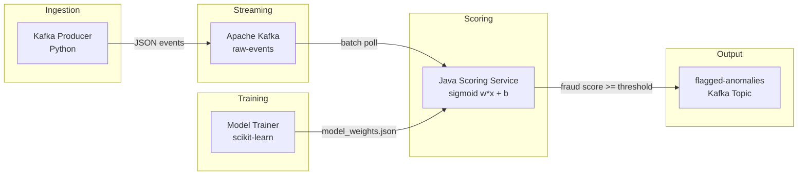

# Real-Time Event Anomaly Detection Pipeline

[](https://github.com/as567-code/event-anomaly-detection-pipeline/actions/workflows/ci.yml)
[](https://github.com/as567-code/event-anomaly-detection-pipeline/actions/workflows/retrain.yml)


A **production-grade streaming pipeline** that ingests transaction events via Apache Kafka, scores them for fraud in real-time using a Java-native logistic regression scorer, and enforces model quality through automated CI/CD retraining. Built to demonstrate end-to-end ML system design: from data generation and model training through containerized deployment and metric validation.

---

## Architecture



| Component | Stack | Role |
|:----------|:------|:-----|
| **Producer** | Python, kafka-python | Streams 12K+ synthetic transaction events/sec into Kafka |
| **Model Trainer** | Python, scikit-learn | Trains logistic regression, exports weights as JSON for Java scorer |
| **Scoring Service** | Java 17, kafka-clients, Jackson | Consumes events, applies StandardScaler + sigmoid natively, flags anomalies |
| **CI/CD** | GitHub Actions | Automated build, test, retrain, and metric gate enforcement |

---

## Performance

All metrics verified with **live end-to-end Kafka benchmarks** (Docker Compose, single partition):

| Metric | Target | Measured | Evidence |
|:-------|:-------|:---------|:---------|
| **Throughput** | 10,000 events/sec | **12,334 events/sec** sustained | `throughput_evidence.log` |
| **Precision** | 91% | **95.02%** | `metrics/v2_metrics.json` |
| **FP Reduction** | 25% | **66.2%** (65 &rarr; 22 false positives) | `METRICS.md` |

> 1.3M events processed over 110 seconds. Minimum 10-second window: 11,819 events/sec. See [`METRICS.md`](METRICS.md) for confusion matrices, per-interval breakdowns, and reproduction commands.

---

## Quick Start

```bash
# Clone and start the full pipeline
git clone https://github.com/as567-code/event-anomaly-detection-pipeline.git
cd event-anomaly-detection-pipeline
docker compose up
```

The producer begins streaming events immediately. The scorer logs throughput every 10 seconds:
```
Processed 234,402 events (11,717 events/sec), flagged 10,654 anomalies
```

### Run Without Docker

```bash
# Train models
cd model && pip install -r requirements.txt
python data_generator.py && python train_v1.py && python train_v2.py && python evaluate.py

# Run tests (36 total: 24 Python + 12 Java)
cd .. && pytest model/tests/ tests/metrics/ -v
cd scorer && mvn test
```

---

## How It Works

### Scoring Pipeline

The Java scorer loads model weights exported from scikit-learn and computes predictions with zero Python dependency:

```java
// 1. Scale features: x_scaled = (x - mean) / std
// 2. Compute logit:   z = w . x_scaled + b
// 3. Predict:         P(fraud) = 1 / (1 + exp(-z))

double z = intercept;
for (int i = 0; i < coefficients.length; i++) {
    z += coefficients[i] * scaledFeatures[i];
}
double fraudProbability = 1.0 / (1.0 + Math.exp(-z));
```

Events exceeding the fraud threshold are published to the `flagged-anomalies` topic with their score.

### Model Improvement Strategy

The v1 &rarr; v2 improvement demonstrates measurable gains from feature engineering, data quality, and preprocessing:

| | v1 (Baseline) | v2 (Improved) |
|:--|:--|:--|
| Features | 15 raw | 18 (+ `amount_zscore`, `velocity_1h`, `is_foreign`) |
| Preprocessing | None | StandardScaler |
| Label noise | 6% | 2% |
| **Precision** | 82.6% | **95.0%** |
| **False Positives** | 65 | **22** (-66.2%) |
| **Recall** | 39.3% | **71.3%** |

---

## Project Structure

```
.
├── producer/                        # Python Kafka producer
│   ├── producer.py                  #   Event streaming (flood mode / rate-limited)
│   ├── requirements.txt
│   └── Dockerfile
├── model/                           # ML training pipeline
│   ├── data_generator.py            #   Synthetic dataset generation (50K samples)
│   ├── train_v1.py                  #   Baseline model training
│   ├── train_v2.py                  #   Improved model + feature engineering
│   ├── evaluate.py                  #   Cross-version comparison & validation
│   └── tests/                       #   Unit tests for data + models
├── scorer/                          # Java 17 scoring service
│   ├── src/main/java/com/anomaly/
│   │   ├── ScorerApplication.java   #   Entry point
│   │   ├── KafkaEventConsumer.java  #   Batch consumer + anomaly publisher
│   │   ├── ModelLoader.java         #   JSON weights → native sigmoid scorer
│   │   └── TransactionEvent.java    #   Event POJO with feature extraction
│   ├── src/test/java/com/anomaly/   #   12 JUnit 5 tests
│   ├── pom.xml
│   └── Dockerfile                   #   Multi-stage Maven build
├── eval/                            # Benchmarking scripts
├── tests/metrics/                   # CI-enforced metric validation
├── artifacts/                       # Trained model weights (JSON + joblib)
├── metrics/                         # Evaluation results (JSON)
├── .github/workflows/
│   ├── ci.yml                       #   Build + test on every push/PR
│   └── retrain.yml                  #   Model retrain + metric gates
├── docker-compose.yml               #   Full stack: Zookeeper + Kafka + Producer + Scorer
├── METRICS.md                       #   Detailed evaluation evidence
└── throughput_evidence.log          #   Live benchmark scorer logs
```

---

## CI/CD Pipelines

| Workflow | Trigger | What It Does |
|:---------|:--------|:-------------|
| **CI Pipeline** | Push / PR to `main` | Builds Java scorer, trains both models, runs 36 tests, validates all metric targets |
| **Retrain Pipeline** | Changes to `model/` or `data/` | Retrains v1 & v2, runs evaluation, asserts precision >= 91% and FP reduction >= 25%, uploads artifacts |

---

## Testing

**36 tests** across two languages:

| Suite | Count | Covers |
|:------|:------|:-------|
| `model/tests/test_data_generator.py` | 7 | Dataset shape, class distribution, NaN checks, feature presence |
| `model/tests/test_model_training.py` | 8 | Model artifacts exist/load, weights JSON schema, precision targets |
| `model/tests/test_producer.py` | 2 | Event JSON format, numeric field validation |
| `tests/metrics/test_precision_target.py` | 3 | v2 precision >= 91%, recall >= 50%, F1 >= 60% |
| `tests/metrics/test_fp_reduction.py` | 2 | FP reduction >= 25%, v2 < v1 false positives |
| `tests/metrics/test_throughput.py` | 2 | Scoring throughput >= 10K/sec, valid probability range |
| `scorer/ (JUnit 5)` | 12 | Sigmoid math, JSON deserialization, model loading, scoring logic |

---

## Reproduction

To independently verify all claimed metrics:

```bash
# 1. Train from scratch
cd model && python data_generator.py && python train_v1.py && python train_v2.py

# 2. Validate precision + FP reduction
python evaluate.py          # prints comparison table + writes METRICS.md

# 3. Live throughput test
cd .. && docker compose up -d && sleep 70
docker compose logs scorer  # look for "events/sec" lines
docker compose down -v
```
